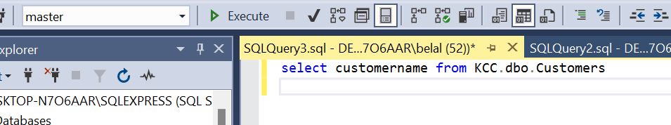
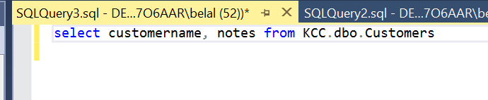

Keep in Mind That...
SQL keywords are NOT case sensitive: `select` is the same as `SELECT`
In this tutorial we will write all SQL keywords in upper-case.

## Some of The Most Important SQL Commands

SQL commands are not case sensitive i.e: SELECT and select are the same.

`SELECT` - extracts data from a database  (allows us to retrieve data from a table)
i.e. `Select` CustomerName `from` dbo.Customers (from is used select where i will get customers name from.)

As shown in the image I can also select the database as I am in the master database I must specify which database in this instance `KCC.`

As shown above I can also choose to query other info like notes for example

i can use `as` to define or customize column header for example;

`select customername as[Customer Name], notes from KCC.dbo.Customers`

`select distinct customername as [Customer Name], notes from KCC.dbo.Customers`

Another command is distinct as shown above: 

To retrieve all the different columns in the table we use the wild card `*` in the following:

`select * from KCC.dbo.Customers` 
and it will display this

You can also use the code below to display top 3 results.
`select top (3)* from KCC.dbo.Customers`

### How to filter data:

We can filter with `where`

for example:

this way we get customers ONLY from the state of Washington.

We can use spaces to make it easy to follow along

also leave comments using `##` 

we can use `where` filter for customers not in WA state for example:

we can also do 
``select * 
from KCC.dbo.Customers
where state = 'WA' or state = 'ny'``

for customers only in these two states.

But after a while it can get out of control if say there are 3 or 4 states for example 
``select * 
from KCC.dbo.Customers
where state = 'WA' or state = 'ny' or state = 'ut'``

 so it is better to do:

``select * 
from KCC.dbo.Customers
where State in('wa' , 'ny' , 'ut')``

and to show customers not in those places we do 

``select * 
from KCC.dbo.Customers
where State not in('wa' , 'ny' , 'ut')``

we added `in`

another way to filter is by using `and` like the following example;

``select *
from KCC.dbo.Customers
where CustomerName = 'tres delicious' and country = 'United states'``

`UPDATE` - updates data in a database

`DELETE` - deletes data from a database

`INSERT INTO` - inserts new data into a database

`CREATE DATABASE` - creates a new database

`ALTER DATABASE` - modifies a database

`CREATE TABLE` - creates a new table

`ALTER TABLE` - modifies a table

`DROP TABLE` - deletes a table

`CREATE INDEX` - creates an index (search key)

`DROP INDEX` - deletes an index

## Useful informaion:
Querying a database involves requesting to access data from a database to retrieve it or manipulate it.

Primary keys serve as unique identifiers for each row in a database table.

